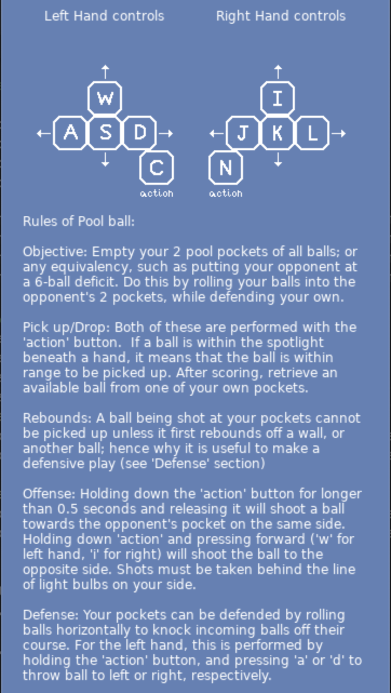

## **Pool Ball: Billiards Gone Wild**
### by Gregory Ryan of Boston, MA, USA
---

**Poolball Gameplay Preview**

*Made with lua in VS-Code using Löve 2d engine*

---

### **Origins**

This is a real-time sports/billiards computer game that mimics the live action version
of the game. The live action version of Pool Ball was created within my circle of
friends, approximately ten years ago, using the pool table in my basement. It was born
out of an episode of collective boredom, but ended up long-outliving that particular day. 
It became a regular pastime for those present during its conception, as well as for others 
that the game would be promulgated to.

### **Controls and Game Rules**

---

## **The Making Of Poolball**

### ***Pixel Art and Animation***

All pixel art and animation was created by myself using the application, Aseprite.
Creating the lighting/shading pattern on the hand sprites was particularly difficult.
As I studied images of balls and hands, I noted that the surfaces interact with light
very differently--the ball having a more predictable and replicable interaction. I tried
to avoid committing the error of 'band shading' with the hand, but when done in
moderation, it actually seemed somewhat appropriate.

Ball animation sets are composed of 4 different frames; each frame represents that the
ball has undergone a quarter-turn, ie. 90 degrees. Ball diameter is 16 pixels, therefore
Circumference is ~50. This means the ball should travel ~50 pixels before returning to its
starting frame. So with 4 frames in an animation set, changes are made to the ball for
every 12.5 pixels it travels. The angle at which the ball is traveling determines which
particular animation set is used. Right now there are 4 different sets; for vertical
travel, horizontal travel, and two different diagonals. For instance, if a ball is
traveling at an angle between 22.5 degrees and 67.5 degrees, the ball will have one of the
diagonal animation sets.

### ***Game Physics***

None of Löve 2d's built-in physics capabilities were used(love.physics class). Instead,
I wanted to challenge myself to replicate the collisions of spherical objects. Mass is equal
in all moving objects capable of collision within the game, so that allowed for simplification
of equations. The most important thing for getting the collisions to be realistic was 
an intermediate step where the axes are rotated so that you are evaluating at least one ball as
having only one dimensional component.

### ***Sounds/Music***

The game's music was made by myself using the DAW, Ableton 9 Live Suite. Sound effects
were made using the same software. The ball collision sound is not at all a sample
of actual billiard balls colliding, but rather a snare drum rim-shot that was modulated
down several steps, with a touch of reverb on it. It was then combined with another sound,
which I would describe as a techno-like 'blip, which was mixed in at a very low volume.

### ***AI/Computer Player***

Creating an AI/computer player was something I had virtually no experience doing. I was
tempted to search for a tutorial, but I felt confident in my conception of what needed
to happen to accomplish the AI. I created a decision tree for each AI hand that first asks
itself if it has a ball in its possession or not. From here, the hand can either worry
about obtaining an available ball, or making a play with the ball it has. That play can be
offensive, defensive, or a repositioning move.  Before playing offense or defense, or
repositioning, the hands assess vulnerabilities in the player's defense, as well as
vulnerabilities in its own defense. For instance, it will shoot almost 100% of the time
if the human player is not in possession of balls. Conversely, AI hand would also be less
likely to shoot if it is only holding on to one ball. The AI hands also check with each
other regularly to make sure they aren't copying one another's intentions, if it would
not make sense to do so.

## **Future Iterations**

### ***Art/Animation***

It is my intention to add more frames to the ball animations, and add more animation
sets, at that. I plan to either double the number of animation sets, or overhaul the ball
animation system altogether. I am considering a system where the 3d-facing of the ball is
updated and recorded every frame/tick of the game, and the subsequent frame rendering is
dependent on the ball object's other current physical attributes.

After submitting this project, and before attending devCodeCamp, I was able to make some 
updates to some of the graphics. You can now select which color set of "poolballs" to 
use. Only some are available at the beginning, and more unique colors and textures can
be unlocked. 

There are also now a few different skin tones that can be selected from that are applied
to the player's hand objects.

Additionally, the table on which the game is played has received some major updates. The sides
are now lined with pulsating, color-changing lights. The wood has a more realistic texture,
and the pockets are decorated. 

### ***AI Updates***

There is probably no such thing as making an AI computer perfect-- but rather the goal of making
it so that its imperfections are negligible or imperceptible. There is a lot of work that could 
be done on the AI, especially in certain difficulty modes. It is currently stable, and provides
a sufficient level of challenge, but needs to continue moving towards sophistication and more
human-like considerations and actions.

### ***Distribution And Multiplayer***

The game is currently only compatible with Mac users. The next step would be to deploy
a version for Windows. Even farther down the line, with more knowledge and skill, I would really
like to make this a multiplayer game. The play style is perfect for friends to face off against
one another, or to play head-to-head with strangers, competing for rank.  

### ***Mobile Considerations***

Another interesting thing to consider is how the resolution of this game would make it a good
fit for a mobile device. Additionally, each match in Poolball runs somewhere between 30 sec
and 5 minutes, so this game as an activity almost fits into the category of micro-distraction.
The mechanics of the gameplay would also be conducive to the use of two thumbs, as you would
typically do with a mobile device.  

---

All in all, this has been a very fun project to work on, and I look forward to continuing
work on it.